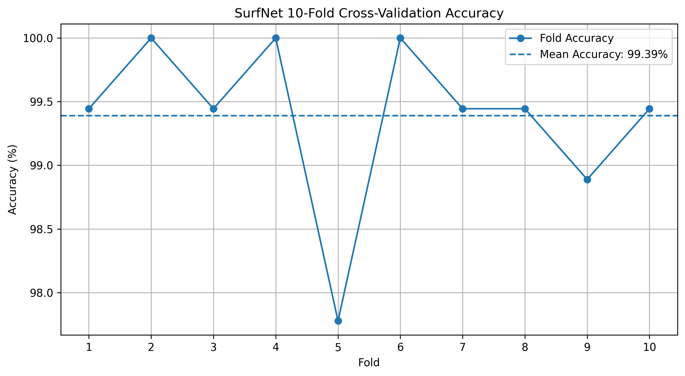

# SurfNet-NEU Surface Defect Classification

A PyTorch-based implementation of a lightweight CNN approach inspired by the **SurfNet** research work for multi-class surface defect classification using the **NEU surface defect dataset**.

The project focuses on implementing the documented SurfNet design principles, training the model on the publicly available NEU dataset, evaluating it using stratified 10-fold cross-validation, and generating visual and numerical performance results.

---

## 📌 Project Overview

Surface defect detection is an important computer-vision task in industrial manufacturing and quality inspection.

This project implements a lightweight convolutional neural network based on the SurfNet approach described in the research paper:

> **"Surface Defect Classification in Real-Time Using Convolutional Neural Networks"**

The publicly available **NEU surface defect dataset** is used for reproducible experimentation.

### Main objectives

* Classify different types of surface defects.
* Implement a lightweight SurfNet-style CNN using PyTorch.
* Use 10-fold stratified cross-validation for evaluation.
* Analyze training behavior using loss, accuracy, and learning-rate curves.
* Generate a confusion matrix and classification metrics.
* Provide a trained model for single-image prediction.

---

## 📄 Reference Paper

**S. Arikan, K. Varanasi, and D. Stricker**,
*"Surface Defect Classification in Real-Time Using Convolutional Neural Networks,"*
arXiv:1904.04671, 2019.

**Paper:**
https://arxiv.org/abs/1904.04671

---

## 📊 Dataset

The **NEU surface defect dataset** contains:

* **1,800 grayscale images**
* **6 defect categories**
* **300 images per class**

### Classes

1. Crazing
2. Inclusion
3. Patches
4. Pitted Surface
5. Rolled-in Scale
6. Scratches

The dataset itself is **not included** in this repository.

Images are converted to grayscale and resized to **128 × 128 pixels** before being supplied to the model.

---

## 🧠 Model

The implementation follows the documented SurfNet design principles, including:

* 5 × 5 convolutional processing
* Batch Normalization
* PReLU activation
* Residual processing
* Stride-based downsampling
* Global Average Pooling
* Fully connected classification layer
* Log-softmax output for multi-class classification

The model performs classification across the six NEU defect categories.

> **Note:** This repository is a practical SurfNet-style implementation based on the documented design principles of the reference paper. It should not be interpreted as an exact reproduction of every implementation detail from the authors' original private dataset experiment.

---

## ⚙️ Training Configuration

| Parameter             | Value              |
| --------------------- | ------------------ |
| Framework             | PyTorch            |
| Input Size            | 128 × 128          |
| Input Channels        | 1 (Grayscale)      |
| Number of Classes     | 6                  |
| Batch Size            | 10                 |
| Optimizer             | RMSProp            |
| Initial Learning Rate | 0.0001             |
| Weight Decay          | 0.1                |
| Loss Function         | NLLLoss            |
| LR Scheduler          | StepLR             |
| LR Reduction Factor   | 0.8                |
| Scheduler Step        | 3 epochs           |
| Maximum Epochs        | 100                |
| Cross Validation      | 10-Fold Stratified |

---

## 🔬 Methodology

The overall workflow is:

```text
NEU Dataset
     ↓
Image Preprocessing
     ↓
128 × 128 Grayscale Images
     ↓
SurfNet-style CNN
     ↓
Training
     ↓
10-Fold Stratified Cross-Validation
     ↓
Performance Evaluation
     ↓
Final Model Training
     ↓
Single-Image Prediction
```

---

## 📈 Evaluation

The project includes:

* 10-fold cross-validation
* Accuracy
* Precision
* Recall
* F1-score
* Confusion matrix
* Training loss graph
* Training accuracy graph
* Learning-rate graph
* Single-image prediction

### Final Training Results

The final model was trained for 100 epochs on the complete NEU dataset.

| Metric                  |          Result |
| ----------------------- | --------------: |
| Final Training Accuracy |      **98.67%** |
| Best Training Accuracy  |      **99.39%** |
| Best Epoch              |          **67** |
| Final Training Loss     |      **0.1295** |
| Initial Learning Rate   |      **0.0001** |
| Final Learning Rate     | **6.34 × 10⁻⁸** |

**Important:** These values are training-set results from the final model and should not be interpreted as an independent test-set accuracy.

---

## 📊 Results and Visualizations

### 10-Fold Cross-Validation Accuracy



### Confusion Matrix


### Training Loss


### Training Accuracy


### Learning Rate Schedule


The numerical results are also available in:

[`results/final_results_table.csv`](results/final_results_table.csv)

---

## 🛠️ Technologies

* Python
* PyTorch
* Torchvision
* NumPy
* Pandas
* Scikit-learn
* Matplotlib
* Seaborn
* Pillow
* Google Colab

---

## 📁 Repository Structure

```text
SurfNet-NEU-Surface-Defect-Classification/
│
├── SurfNet_NEU.ipynb
├── SurfNet_NEU.pth
├── requirements.txt
├── README.md
│
└── results/
    ├── 10fold_accuracy.png
    ├── confusion_matrix.png
    ├── final_results_table.csv
    ├── learning_rate.png
    ├── training_accuracy.png
    └── training_loss.png
```

---

## 🚀 How to Use

### 1. Install dependencies

```bash
pip install -r requirements.txt
```

### 2. Open the notebook

Open:

```text
SurfNet_NEU.ipynb
```

The notebook can be executed in **Google Colab** or another compatible Python/Jupyter environment.

### 3. Prepare the dataset

Download the NEU surface defect dataset separately and organize the images according to the class structure expected by the notebook.

The dataset is intentionally not included in this repository.

### 4. Run the notebook

The notebook contains the complete workflow:

```text
Dataset Loading
      ↓
Preprocessing
      ↓
Model Construction
      ↓
Training
      ↓
10-Fold Cross-Validation
      ↓
Final Training
      ↓
Evaluation
      ↓
Prediction
```

---

## 💾 Trained Model

The trained PyTorch model is provided as:

```text
SurfNet_NEU.pth
```

The model can be loaded using PyTorch for further experimentation and single-image prediction.

---

## ⚠️ Reproducibility Note

The reference paper reports experiments involving its own surface-image dataset containing more than 22,000 labeled images, while the implementation in this repository uses the publicly available **NEU dataset**.

Therefore, the results in this repository represent the implementation and evaluation performed on the NEU dataset and should not be presented as a direct reproduction of the paper's private-dataset experiment.

---

## 📚 Citation

If you refer to the research work behind this project, please cite:

```text
S. Arikan, K. Varanasi, and D. Stricker,
"Surface Defect Classification in Real-Time Using Convolutional Neural Networks,"
arXiv:1904.04671, 2019.
```

---

## 👩‍💻 Project

**SurfNet-NEU Surface Defect Classification**

Research implementation and experimental study using PyTorch and the NEU surface defect dataset.
